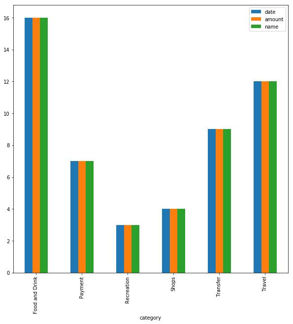
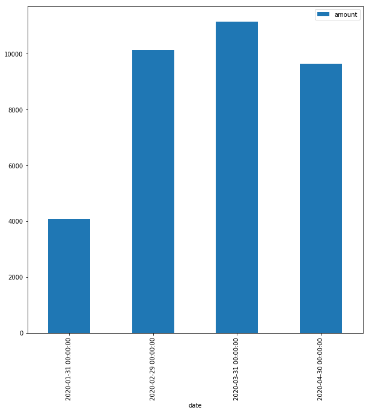
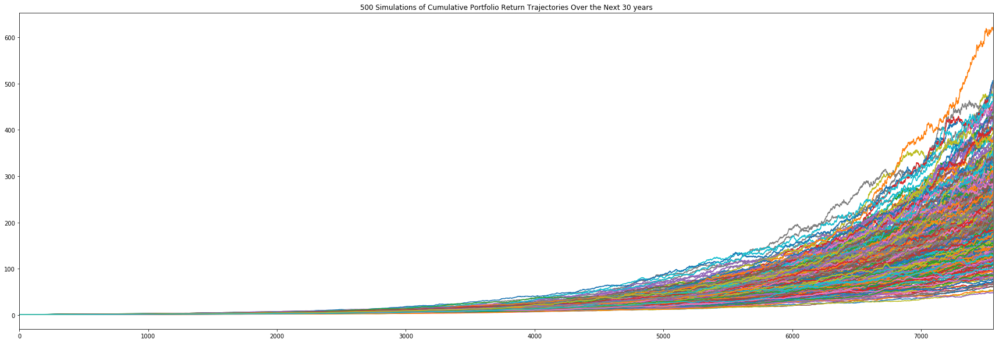
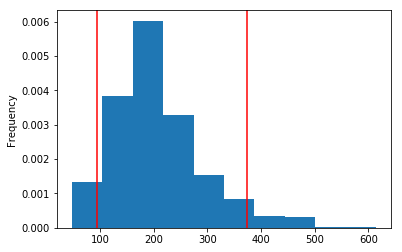

# Financial report

## Budget analysis

1. Expenses per category

- Food and Drink   3817.19
- Payment          8389.00
- Recreation        235.50
- Shops            2000.00
- Transfer        20537.34
- Travel             35.19

2. Expenses per month

- 2020-01-31   4084.83
- 2020-02-29  10145.24
- 2020-03-31  11145.24
- 2020-04-30   9638.91

3. Income analysis

- Previous year gross income was 7285
- The current monthly income is 500
- The projected yearly net income is 6085
- The projected yearly gross income is 7389

## Retirement Planning

1. Montecarlo simulation

2. 90% Confidence interval

3. Expected cumulative returns at 30 years for the 10th, 50th, and 90th percentiles

- Expected cumulative return in 30 years for 10th percentile is 109.41
- Expected cumulative return in 30 years for 50th percentile is 200.57
- Expected cumulative return in 30 years for 90th percentile is 311.56

4. Expected portfolio return in dollars at the 10th, 50th, and 90th percentiles given a 20,000 initial investment

- Expected portfolio return in dollars at 10th percentile is 2188178.25
- Expected portfolio return in dollars at 50th percentile is 4011355.09
- Expected portfolio return in dollars at 90th percentile is 6231111.60

5. Retirement income versus projected income

- Projected income over 30 years is 221670.00
- Retirement portfolio with a 4% withdrawal rate in the 10th percentile is 181340.33
- The retirment portfolio in the 10th Percentile will be lower that the projected income over 30 years given the 4% withdrawal rate

6. 50% additinal investment for retirement income versus projected income

- A 50% increase in the initial investment with a 4% withdrawal rate will result in a retirement income of 272010.50
- The 4% retirment withdrawal will be higher but as a result, the retirement income will be higher than the projected income